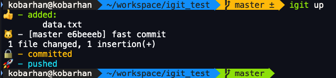
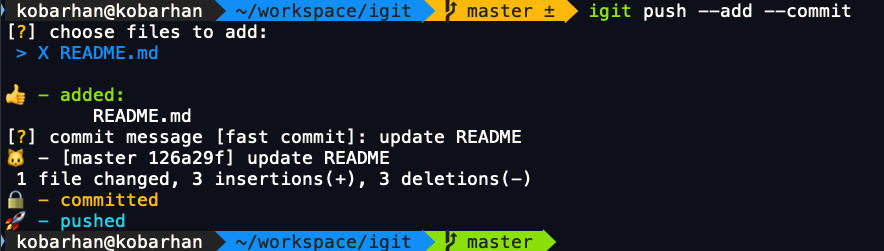
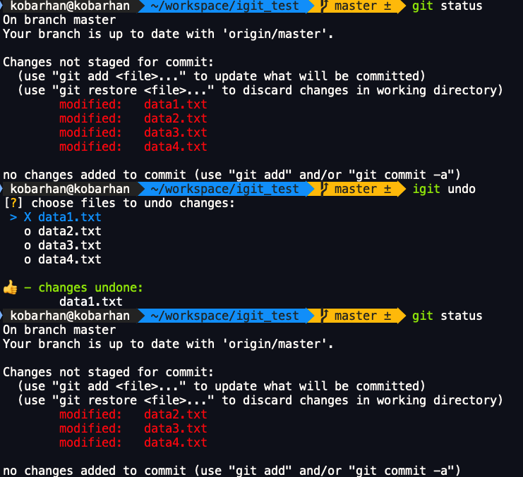
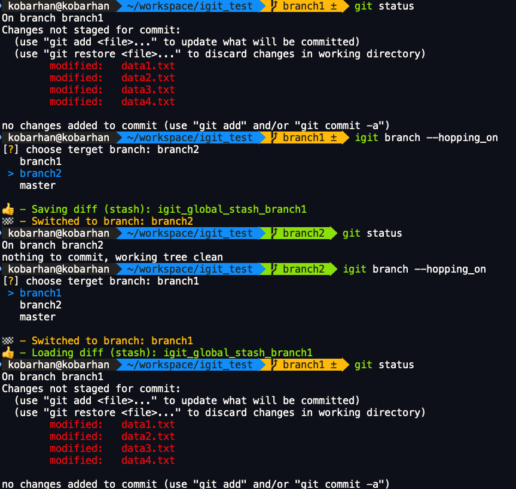
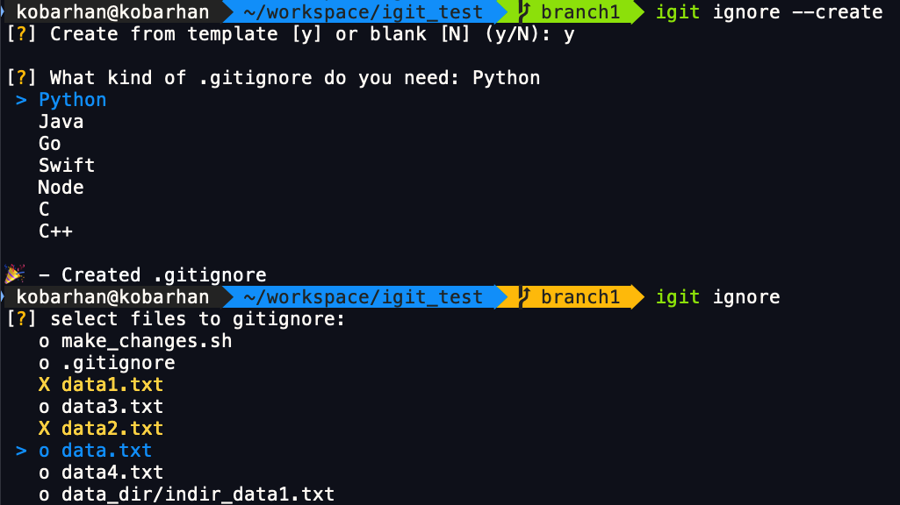

[](https://travis-ci.com/kobibarhanin/igit)
[](https://badge.fury.io/py/igit)

# Igit - Interactive Git

## TL;DR:
Igit is an interactive supplementary CLI to git for better git experience.

## The Story:
For a long time I've been using a variety of aliases for git commands, some of which were custom and aimed to boosting my git productivity - so I've decided to  package it into a product for others to use.

## Main features:
1. Fast commits - add, commit & push, instantly. 
2. Undo changes - cancel changes made to any file.
3. Branch hopping - move between branches, even if you have unstaged changes, without having to stage them.
4. Easy ignore - add files to ignore, sync with remote. 
5. Interactivity - select and check instead of typing.


## Installation

With [pip](https://pip.pypa.io/en/stable/):

```bash
pip install igit
```

## Usage


### Fast commits

#### From:
```bash
git add .
git commit -m "commit message"
git push 
```

#### To:
```bash
igit up "commit message" 
```



#### Or:
You can also go through the whole interactive process:


#### Notes:
- If you don't specify a commit message it will default to 'fast commit'.
- Same goes for ```igit save``` - without pushing to remote.


### Undo changes

```bash
# To undo changes in an unstaged changed file:
igit undo file_1.py 
# To pick a file just drop the file's name:
igit undo
```



#### Notes:
- Same goes for ```igit unstage``` with respect to added files.


### Branch hopping

```bash
# To change branches:
igit branch
# To change branches with unstaged changes:
igit branch --hopping_on 
```


#### Notes:
- When in hopping mode all change are stored to the git stash. 
You can use ```git stash list``` to see stashed changes and ```git stash pop``` to retrieve stashed changes


### Branch hopping

```bash
# To add files to .gitignore:
igit ignore
# To create a .gitignore:
igit ignore --create  
```


#### Notes:
- In case your local .gitignore is not in sync with your remote .gitignore you can use: 
```bash
# Reset .gitignore:
igit ignore --reset 
```
And then push to remote - your current .gitignore will take effect. 

## Compatibility
igit is cross-platform → Windows, macOS, Linux 

🤓 windows users will get best experience with windows terminal - powershell session.
	

## Built with

- click
- gitpython
- inquirer
- emoji

## Contributing
Pull requests are welcome. For major changes, please open an issue first to discuss what you would like to change.
Please make sure to update tests as appropriate.

### Local dev environment (macOS / Linux)

- Clone this project
- cd into project directory
- Run: pipenv install
- Run: pipenv --venv 
- Add [bash alias](https://linuxize.com/post/how-to-create-bash-aliases/):
```bash
alias igit='PYTHONPATH=<LOCAL GITSY PROJECT DIR> <PIPENV VENV PATH>/bin/python3 <LOCAL IGIT PROJECT DIR>/igit/cli.py'
```
- Now you can run igit from bash and code changes in local igit dir will apply.


## License
[MIT](https://choosealicense.com/licenses/mit/)
